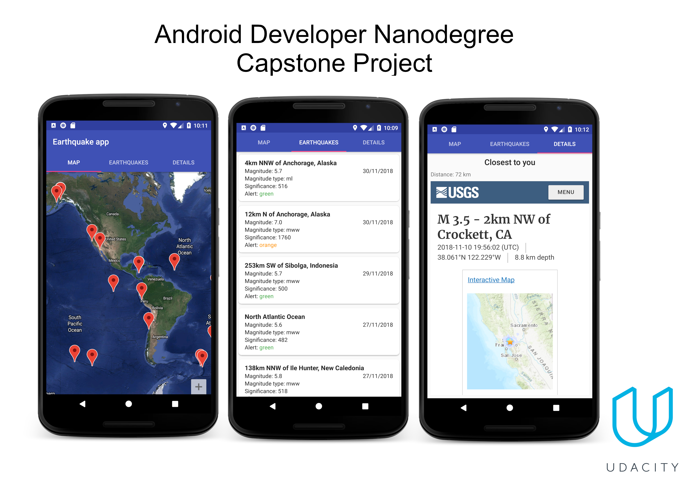

## Capstone Project
Application which helps you track latest earthquakes from around the globe by showing latest earthquakes of 450+ significance level. Data is shown on maps, list and application also shows earthquake of the highest magnitude near your place of living.

Capstone Project was created as a part of Udacity [Android Developer Nanodegree Program](https://eu.udacity.com/course/android-developer-nanodegree-by-google--nd801). Application was build with MVVM architecture.

## Used Libraries
- [Android Architecture Components](https://developer.android.com/topic/libraries/architecture/)
- [RxJava2](https://github.com/ReactiveX/RxJava), [RxAndroid](https://github.com/ReactiveX/RxAndroid)
- [Dagger2](https://github.com/google/dagger)
- [Retrofit2](https://github.com/square/retrofit) with [RxJava adapter](https://github.com/square/retrofit/tree/master/retrofit-adapters/rxjava2)
- [Butterknife](https://github.com/JakeWharton/butterknife)
- [Gson](https://github.com/google/gson)
- [Picasso](http://square.github.io/picasso/)
- [JobDispatcher](https://github.com/firebase/firebase-jobdispatcher-android)
- [Location Service](https://developers.google.com/android/guides/releases)

## Project Overview
- Application is using google maps API
- For offline situations app will be displaying data from Room database
- App is using Firebase’s JobDispatcher for update the data at regular intervals
- App is using Google Location service to get current location
- Data older than 30 days is deleted from database
- Application calculates and shows the closest earthquake to the user 
